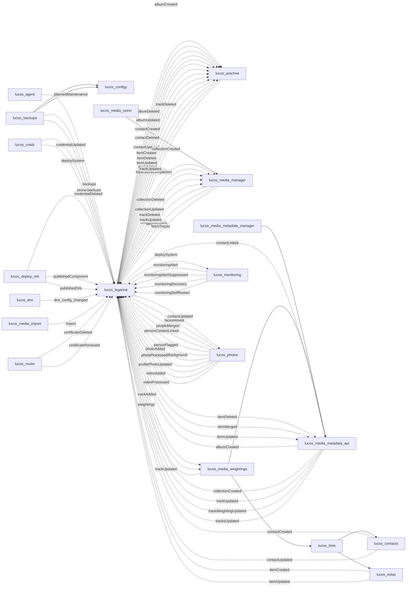

# lucOS estate — connected core (generated)

```mermaid
flowchart LR
  lucos_agent["lucos_agent"]
  lucos_arachne["lucos_arachne"]
  lucos_backups["lucos_backups"]
  lucos_configy["lucos_configy"]
  lucos_contacts["lucos_contacts"]
  lucos_creds["lucos_creds"]
  lucos_deploy_orb["lucos_deploy_orb"]
  lucos_dns["lucos_dns"]
  lucos_eolas["lucos_eolas"]
  lucos_loganne["lucos_loganne"]
  lucos_media_import["lucos_media_import"]
  lucos_media_manager["lucos_media_manager"]
  lucos_media_metadata_api["lucos_media_metadata_api"]
  lucos_media_metadata_manager["lucos_media_metadata_manager"]
  lucos_media_seinn["lucos_media_seinn"]
  lucos_media_weightings["lucos_media_weightings"]
  lucos_monitoring["lucos_monitoring"]
  lucos_photos["lucos_photos"]
  lucos_router["lucos_router"]
  lucos_time["lucos_time"]
  %% sync deps (solid)
  lucos_backups --> lucos_configy
  lucos_backups --> lucos_configy
  lucos_media_metadata_manager --> lucos_media_metadata_api
  lucos_media_seinn --> lucos_media_manager
  lucos_media_weightings --> lucos_media_metadata_api
  lucos_media_weightings --> lucos_time
  lucos_time --> lucos_contacts
  lucos_time --> lucos_eolas
  %% async producers (dotted, → loganne)
  lucos_agent -.plannedMaintenance.-> lucos_loganne
  lucos_arachne -.knowledgeIngest.-> lucos_loganne
  lucos_arachne -.tripleStoreCompaction.-> lucos_loganne
  lucos_backups -.backups.-> lucos_loganne
  lucos_backups -.prune-backups.-> lucos_loganne
  lucos_contacts -.contactCreated.-> lucos_loganne
  lucos_contacts -.contactUpdated.-> lucos_loganne
  lucos_creds -.credentialDeleted.-> lucos_loganne
  lucos_creds -.credentialUpdated.-> lucos_loganne
  lucos_deploy_orb -.deploySystem.-> lucos_loganne
  lucos_deploy_orb -.publishedComponent.-> lucos_loganne
  lucos_deploy_orb -.publishedOrb.-> lucos_loganne
  lucos_dns -.dns_config_changed.-> lucos_loganne
  lucos_eolas -.itemCreated.-> lucos_loganne
  lucos_eolas -.itemUpdated.-> lucos_loganne
  lucos_media_import -.import.-> lucos_loganne
  lucos_media_manager -.collectionSwitch.-> lucos_loganne
  lucos_media_manager -.deviceSwitch.-> lucos_loganne
  lucos_media_manager -.fetchTracks.-> lucos_loganne
  lucos_media_metadata_api -.albumCreated.-> lucos_loganne
  lucos_media_metadata_api -.collectionCreated.-> lucos_loganne
  lucos_media_metadata_api -.trackUpdated.-> lucos_loganne
  lucos_media_metadata_api -.trackWeightingUpdated.-> lucos_loganne
  lucos_media_metadata_api -.tracksUpdated.-> lucos_loganne
  lucos_media_weightings -.weightings.-> lucos_loganne
  lucos_monitoring -.monitoringAlert.-> lucos_loganne
  lucos_monitoring -.monitoringAlertSuppressed.-> lucos_loganne
  lucos_monitoring -.monitoringRecovery.-> lucos_loganne
  lucos_monitoring -.monitoringSelfRestart.-> lucos_loganne
  lucos_photos -.facesMoved.-> lucos_loganne
  lucos_photos -.peopleMerged.-> lucos_loganne
  lucos_photos -.personContactLinked.-> lucos_loganne
  lucos_photos -.personFlagged.-> lucos_loganne
  lucos_photos -.personMarkedBackground.-> lucos_loganne
  lucos_photos -.photoAdded.-> lucos_loganne
  lucos_photos -.photoProcessed.-> lucos_loganne
  lucos_photos -.profilePhotoUpdated.-> lucos_loganne
  lucos_photos -.videoAdded.-> lucos_loganne
  lucos_photos -.videoProcessed.-> lucos_loganne
  lucos_router -.certificateDeleted.-> lucos_loganne
  lucos_router -.certificateRenewed.-> lucos_loganne
  %% async consumers (dotted, loganne →)
  lucos_loganne -.albumCreated.-> lucos_arachne
  lucos_loganne -.albumDeleted.-> lucos_arachne
  lucos_loganne -.albumUpdated.-> lucos_arachne
  lucos_loganne -.contactCreated.-> lucos_arachne
  lucos_loganne -.contactDeleted.-> lucos_arachne
  lucos_loganne -.contactUpdated.-> lucos_arachne
  lucos_loganne -.itemCreated.-> lucos_arachne
  lucos_loganne -.itemDeleted.-> lucos_arachne
  lucos_loganne -.itemUpdated.-> lucos_arachne
  lucos_loganne -.trackAdded.-> lucos_arachne
  lucos_loganne -.trackDeleted.-> lucos_arachne
  lucos_loganne -.trackUpdated.-> lucos_arachne
  lucos_loganne -.collectionCreated.-> lucos_media_manager
  lucos_loganne -.collectionDeleted.-> lucos_media_manager
  lucos_loganne -.collectionUpdated.-> lucos_media_manager
  lucos_loganne -.trackDeleted.-> lucos_media_manager
  lucos_loganne -.trackUpdated.-> lucos_media_manager
  lucos_loganne -.contactLinked.-> lucos_media_metadata_api
  lucos_loganne -.itemDeleted.-> lucos_media_metadata_api
  lucos_loganne -.itemMerged.-> lucos_media_metadata_api
  lucos_loganne -.itemUpdated.-> lucos_media_metadata_api
  lucos_loganne -.trackAdded.-> lucos_media_weightings
  lucos_loganne -.trackUpdated.-> lucos_media_weightings
  lucos_loganne -.deploySystem.-> lucos_monitoring
  lucos_loganne -.contactUpdated.-> lucos_photos
```
